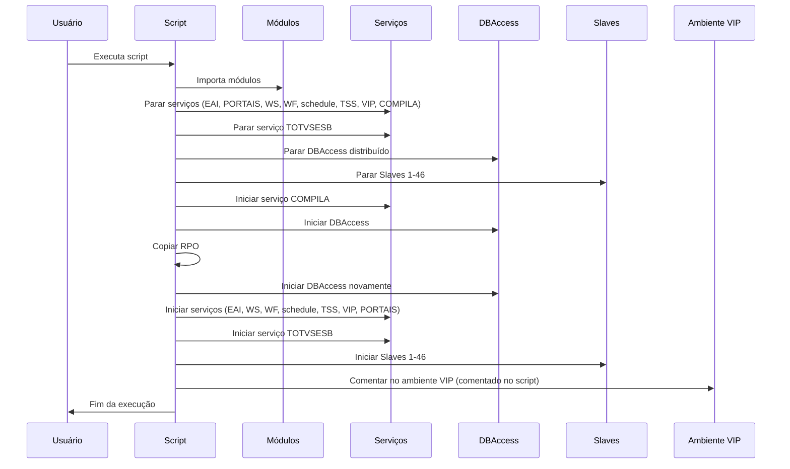

# Atualização do Protheus
Segue diagrama do passo a passo

```mermaid
sequenceDiagram
    participant U as Usuário
    participant S as Script
    participant M as Módulos
    participant Srv as Serviços
    participant DB as DBAccess
    participant Slv as Slaves
    participant VIP as Ambiente VIP

    U->>S: Executa script
    S->>M: Importa módulos
    S->>Srv: Parar serviços (EAI, PORTAIS, WS, WF, schedule, TSS, VIP, COMPILA)
    S->>Srv: Parar serviço TOTVSESB
    S->>DB: Parar DBAccess distribuído
    S->>Slv: Parar Slaves 1-46
    S->>Srv: Iniciar serviço COMPILA
    S->>DB: Iniciar DBAccess
    S->>S: Copiar RPO
    S->>DB: Iniciar DBAccess novamente
    S->>Srv: Iniciar serviços (EAI, WS, WF, schedule, TSS, VIP, PORTAIS)
    S->>Srv: Iniciar serviço TOTVSESB
    S->>Slv: Iniciar Slaves 1-46
    S->>VIP: Comentar no ambiente VIP (comentado no script)
    S->>U: Fim da execução

```
